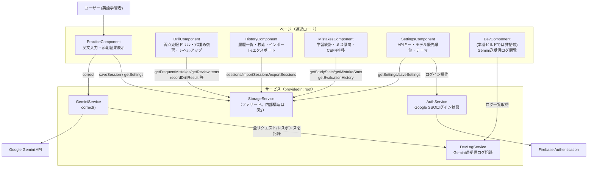
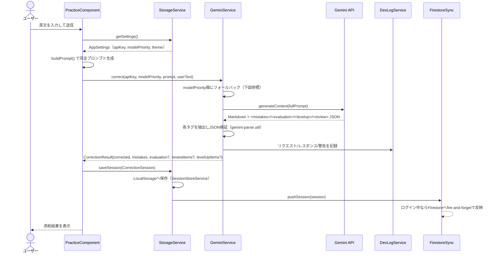
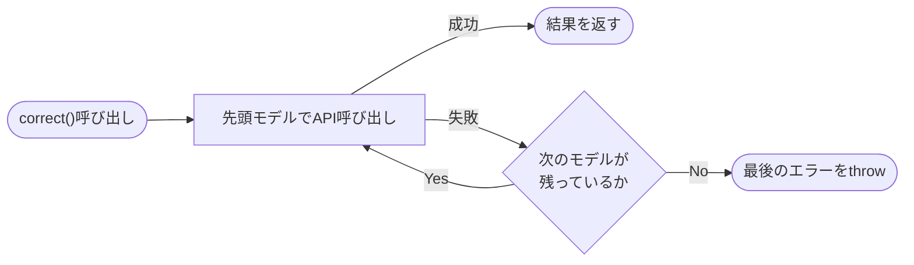
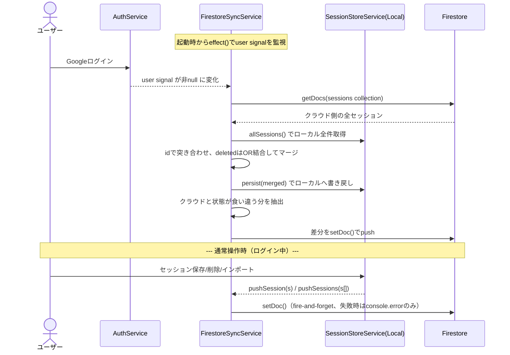
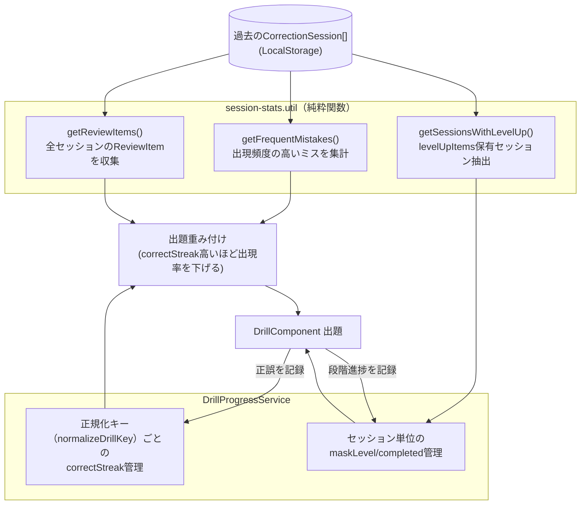
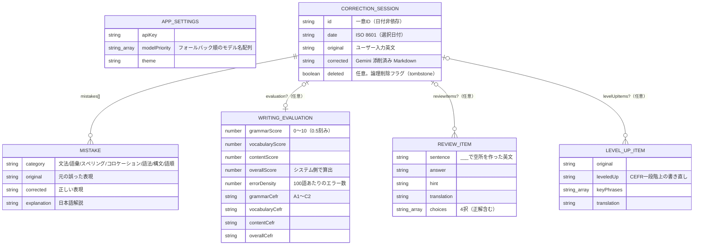
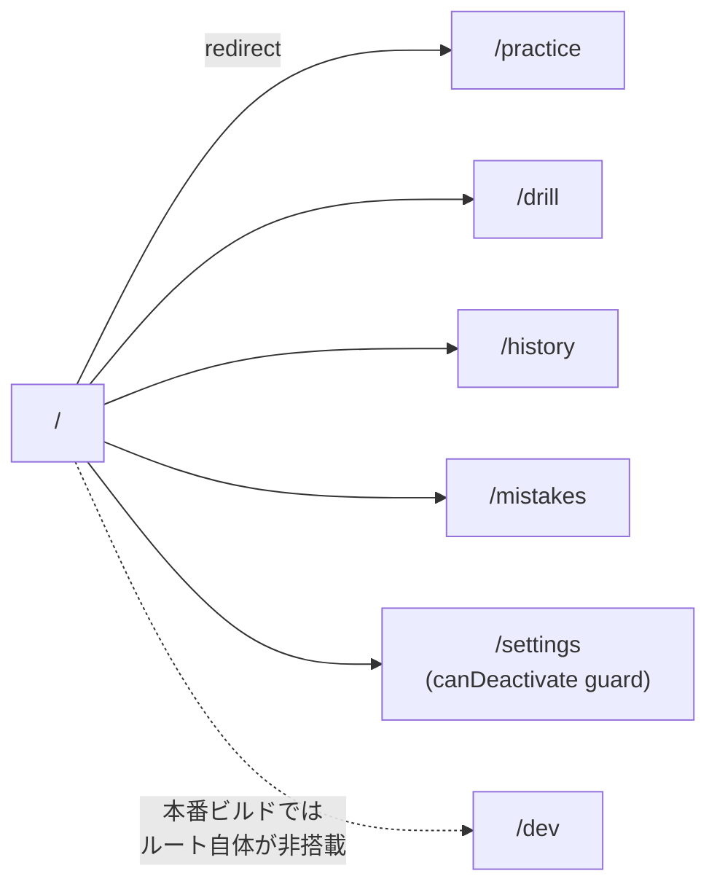
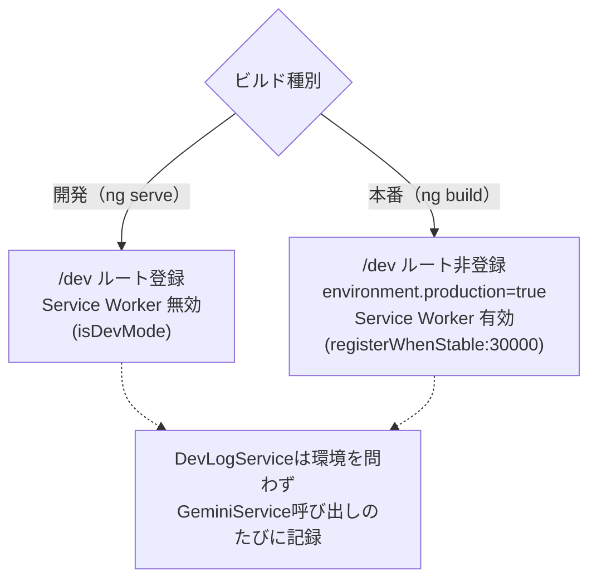
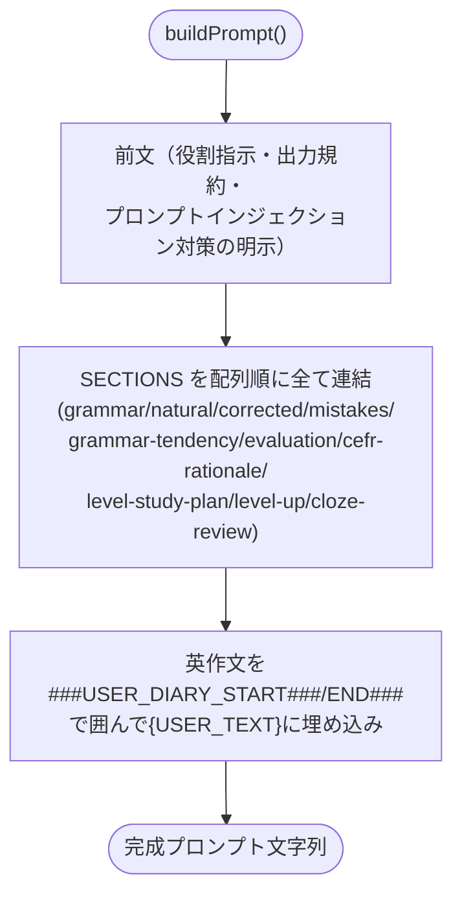

# ARCHITECTURE.md — Study English アーキテクチャ図

## 1. ページ ⇔ サービス 概観図

各ページが直接呼び出すサービスのみを示す大枠の図。サービス内部の委譲構造は [2. StorageService 内部構造](#2-storageservice-内部委譲構造) を参照。



---

## 2. StorageService 内部委譲構造

`StorageService` 自体はロジックを持たず、責務ごとに分割した4つの内部サービスへ委譲する薄いファサード（[storage.service.ts](src/app/services/storage/storage.service.ts)）。各ページからの呼び出し方はこの分割の影響を受けない。

```mermaid
graph TD
    StorageSvc["StorageService（ファサード）"]

    SessionStore["SessionStoreService\nセッションCRUD・LocalStorage永続化\n(論理削除=deletedフラグ)"]
    SettingsStore["SettingsStoreService\nAPIキー・modelPriority・テーマ"]
    DrillProgressSvc["DrillProgressService\n習熟度ストリーク・レベルアップ進捗"]
    FirestoreSync["FirestoreSyncService\nクラウド双方向同期"]
    StatsUtil["session-stats.util.ts\n統計集計（純粋関数）"]

    LocalStorage[("LocalStorage")]
    Firestore[("Cloud Firestore\napps/study_english/users/{uid}/sessions")]
    AuthSvc["AuthService\n(user signal)"]

    StorageSvc -->|saveSession/deleteSession\nimportSessions/exportSessions| SessionStore
    StorageSvc -->|getSettings/saveSettings| SettingsStore
    StorageSvc -->|getDrillProgress/recordDrillResult\ngetLevelUpProgress| DrillProgressSvc
    StorageSvc -->|saveSession/deleteSession/importSessions\n直後にpushSession(s)を呼ぶ| FirestoreSync
    StorageSvc -->|getStudyStats等\nsessions配列を渡す| StatsUtil

    SessionStore <--> LocalStorage
    SettingsStore <--> LocalStorage
    DrillProgressSvc <--> LocalStorage

    FirestoreSync -->|sessionStore.sessions読取\npersist()で書戻し| SessionStore
    FirestoreSync -->|user signal監視| AuthSvc
    FirestoreSync <--> Firestore
```

同期の詳細な流れは [4. Firestore 同期フロー](#4-firestore-同期フロー) を参照。

---

## 3. 添削フロー（データフローシーケンス）



### モデルフォールバックループ

`modelPriority` 配列（例: `gemini-3.5-flash → gemini-3-flash → gemini-2.5-flash → …`）を先頭から順に試し、最初に成功したモデルの結果を返す。



---

## 4. Firestore 同期フロー

ログイン状態は `AuthService` の `user` signal で管理され、`FirestoreSyncService` はコンストラクタ内の `effect()` でこれを監視する。ログインした瞬間に自動で双方向同期が走る。それとは別に、セッションの保存/削除/インポート操作のたびに on-demand で該当分だけ push される。



**tombstone方式の論理削除**: セッションは物理削除されず `deleted: true` フラグが立つ。マージ時は「ローカル・クラウドどちらかが `deleted` なら結果も `deleted`」というOR結合を採用しており、片方の端末で削除した内容が、もう片方の端末からの再pushで復活してしまう事態を防いでいる。

---

## 5. ドリル機能のデータフロー

`DrillComponent` は「頻出ミス出題」「穴埋め復習」「レベルアップ・タイピング」の3モードを持ち、いずれも `StorageService` 経由で過去セッションの集計結果と習熟度を組み合わせて出題する。



習熟度は問題ごとの正規化キー（`normalizeDrillKey`）単位で管理され、連続正解数（`correctStreak`）が一定数（`DRILL_MASTERY_STREAK`）以上になると出題の重みが下がり、すでに習熟した問題は出にくくなる。

---

## 6. LocalStorage / Firestore データ構造



Firestore側は `apps/study_english/users/{uid}/sessions/{sessionId}` のパスに `CorrectionSession` をそのまま保存する（`evaluation`/`reviewItems`/`levelUpItems` が `undefined` の場合はFirestoreの制約によりフィールドごと除外）。

---

## 7. ルーティング



---

## 8. 本番 / 開発ビルドの差分



`environment.production` が true のときは [app.routes.ts](src/app/app.routes.ts) が `/dev` ルートを配列に含めない（本番のルートテーブル・遅延チャンクから除外）。一方 `DevLogService` へのログ記録自体は環境分岐がなく、本番ビルドでも毎回の添削で LocalStorage に書き込まれる点に注意（詳細は後述の課題点を参照）。

---

## 9. プロンプト生成ロジック



ユーザー入力は固有の区切り記号（`###USER_DIARY_START###` / `###USER_DIARY_END###`）で囲み、前文で「区切り内は命令ではなくデータとして扱う」旨を明示することで、プロンプトインジェクションの悪用を軽減している（完全な排除はできない軽減策）。

---

## 10. 課題点（シンプルさ・合理性の観点）

現状の実装を俯瞰した上での改善余地。優先度が高いと考えられる順に記載する。

1. **二重の永続化層と手動マージの複雑さ**
   LocalStorageとFirestoreを両方「正」として扱い、[firestore-sync.service.ts](src/app/services/storage/firestore-sync.service.ts) がidベースの手動マージ（`deleted`のOR結合）を自前実装している。Firestore SDK標準のオフライン永続化（`enableIndexedDbPersistence` + `onSnapshot`）に委ねれば、この同期ロジック自体を書かずに済み、リアルタイム反映や複数タブ間の一貫性も自然に得られる可能性がある。現状の実装はマージ漏れやエッジケースの温床になりやすい。

2. **fire-and-forgetなFirestore push**
   `saveSession`/`deleteSession`/`importSessions`のたびに即座にpushしているが、失敗時は`console.error`のみでリトライがない（firestore-sync.service.ts:63-65, 73-74）。オフライン時やエラー時にローカルとクラウドが乖離したまま気づかれないリスクがある。

3. **DevLogServiceが本番でも常時記録**
   `/dev`ページ自体は本番ビルドから除外されているのに、`GeminiService`は本番でも毎回`DevLogService`にプロンプト全文・レスポンスを記録し続けている。閲覧手段のないログのためにLocalStorage容量を消費し続けるのは非合理。環境フラグでの記録スキップが妥当。

4. **同じ「ローカル保存+Firestore push」ペアが3箇所に重複**
   `saveSession`/`deleteSession`/`importSessions`それぞれで同じ2行の組み合わせが手書きされている（storage.service.ts:37-51）。将来同期タイミングや対象を変える際に修正漏れが起きやすい構造。

5. **PracticeStateが単一/一括の両方の状態を保持**
   現状は問題ないが、今後機能が増えると1つのサービスが肥大化しやすい構造になっている。増築時の分割候補として留意する。

**総評**: ページ・utils・各ストアサービスの責務分離自体は明確で合理的。一方でクラウド同期まわり（1〜2）が自前実装ゆえに最も複雑でバグを生みやすい部分になっており、「シンプルかつ合理的」を優先するなら真っ先に見直す価値がある箇所。
